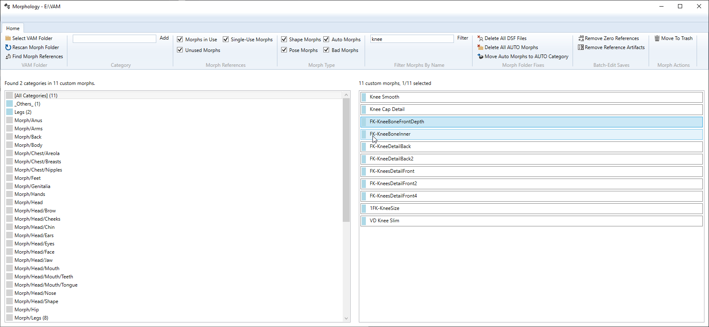

# Morphology
An organizing tool for custom morphs in Virt-a-Mate

## Installation
- download the [installer package](https://github.com/morph1sm/morphology/releases/download/0.3/Morphology.v3.0.zip)
- unzip installer, e.g. in your Downloads folder
- run `setup.exe` to install the Morphology app (if you have an older version, please first uninstall it via Windows Settings -> Apps )
###Standalone version
If you prefer not to use the installer, please:
- ensure that you have .Net Framework 4.8 installed
- download the [standalone package](https://github.com/morph1sm/morphology/releases/download/0.3/Morphology.v3.0.standalone.zip)
- extract it to a folder of your choice
- run Morphology.exe

## Usage
- tell Morphology where your VAM lives via the `Select VAM Folder` button
- select a region on the left and see all of its morphs on the right
- drag one or more morphs to any region to organize them to your liking

That's it.

Morphology also has other helpful features:

### Add Region
If the current list of regions doesn't have a region you think makes sense, create it yourself!

### Morph Filters
Only display the Morphs you are interested in, by checking or unchecking the **View Options**

#### Unused Morphs
Show morphs that are not used in any of your scenes.

#### Single-Use Morphs
Show morphs that are only used in one scene.

#### Shape Morphs
Show morphs that affect the geometry of a look.

#### Pose Morphs
Show morphs that affect the rotation and location of the bones of a look.

#### Auto Morphs
Show morphs that were imported by loading a VAC file. These are usually stored in a special folder called **AUTO**.

#### Bad Morphs
Show morphs that are known to affect geometry outside of their region. These are usually undesirable to have, but you could also keep them and just ensure they are not used anywhere outside their original scene.

### Delete All DSF Files
Custom morphs are imported into VaM via the DSF file format origination from the DAZ Studio app. They are only needed one time for VaM to import them and only slow down scene loading after that. They are safe to delete. You could always copy them again from your DAZ library to VaM's custom morphs folder for re-importation.

### Delete All Auto Morphs
If you are just exploring some random scenes, but are not interested in keeping and sorting out the various imported morphs, you can prune them from your library with this quick fix. If you want to restore a deleted auto morph, load the corresponding VAC file in VaM and they will be re-imported.

### Move Auto Morphs to AUTO Region
The main issue with organizing your morph library are the random morphs installed by opening various VAC files in VaM. Every user has different ideas about region names and organization schemes, so you end up with lots of different region names containing just 2 or 3 morphs.

Fortunately, VaM copies morphs imported from scenes to a special subfolder called AUTO in your main morph folders. This quick fix, renames the region for all of these imported morphs to AUTO. All the funny region names go away and you can still find all these morphs in the AUTO region, should you want to move them into your regular library regions.

### Find Morph References
Scans your **Saves** folder for scenes and looks counts how many scenes or looks are using each custom morph. After the scan completes, you will see a count next to the morph name in the list on the right.

### Remove Inactive Morphs
*Not yet implemented*: Will prune morphs from all scenes and looks if their value is 0.0, i.e. if that morph is unused. This usually happens when a morph was tried out, but then zeroed out by the scene/look creator. This will make your scenes smaller and also stop counting it as a reference.

### Remove Morph Artifacts
*Not yet implemented*: Same as above, but for whatever reason the morph is stored with a tiny value, e.g. `0.000000001`. In essence it is an unused morph, but technically it is used because the value is not 0. This feature will remove these morph artifacts. You can select the pruning sensitivity by entering you own treshold value.

## Roadmap
### v0.3.5
- rename regions
- rename morphs
- let user pick folder when scanning scenes/looks
- set `isPoseControl` flag when morph is moved to built-in pose region
- clear `isPoseControl` flag when morph is moved to built-in morph region
- rename "Region" to "Category" to match VAM terminology
- quick fix for invalid `CheekBone  Width Outer` morph for legacy scenes
- implement `Remove Inactive Morphs`
- implement `Remove Morph Artifacts`

### v0.4
- install DSF and pre-sort by region so the new morphs are imported into your region of choice
- importing some DUF to VAP
- user-defined blacklist
- identify bad/blacklisted morphs by checksum (of .vmb) not name

### v0.5
- add license info to VMI (VaM morph metadata)
- mark sharable vs copyrighted morphs
- remove copyrighted morph refrences from scenes

### v0.6
- integrate with DAZ product lists to find original metadata for installed morphs
- import and correct morph regions based on DAZ product lists
